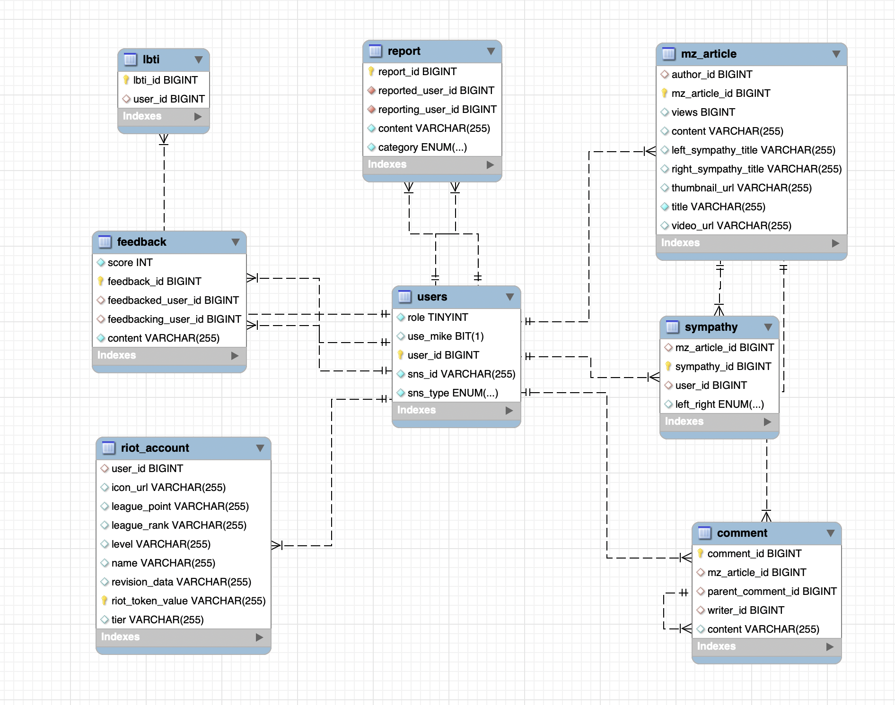

# User Server Branch

유저와 관련된 비즈니스 로직을 수행하는 WAS(Web Application Server)입니다.

이 브랜치는 develop 브랜치에서 분기되었습니다.

## 목차

1. [Directory 구조](#Directory-구조)
2. [ERD](#ERD)
3. [DB 포팅 메뉴얼](#DB-포팅-메뉴얼)

# Directory 구조

```java
── src
    ├── main  // 메인 디렉터리
    │   ├── java
    │   │   └── com
    │   │       └── ssafy
    │   │           └── matchup  // artifact : matchup
    │   │               ├── MatchupApplication.java // 메인 어플리케이션
    │   │               ├── global  // 글로벌 세팅
    │   │               │   └── entity  // BaseEntity : Auditing을 위한 BaseEntity
    │   │               │       ├── BaseTimeActorEntity.java
    │   │               │       └── BaseTimeEntity.java
    │   │               ├── mz  // 게시판 도메인
    │   │               │   ├── article  // 게시글
    │   │               │   │   └── entity
    │   │               │   │       ├── ArticleContent.java
    │   │               │   │       └── MzArticle.java
    │   │               │   ├── comment  // 댓글
    │   │               │   │   └── entity
    │   │               │   │       └── Comment.java
    │   │               │   └── sympathy  // 공감
    │   │               │       └── entity
    │   │               │           ├── Sympathy.java
    │   │               │           └── SympathyType.java
    │   │               └── user  // 사용자 도메인
    │   │                   ├── feedback  // 피드백
    │   │                   │   └── entity
    │   │                   │       └── Feedback.java
    │   │                   ├── lbti  // 롤비티아이
    │   │                   │   └── entity
    │   │                   │       └── Lbti.java
    │   │                   ├── main  // 사용자 메인 엔티티, 서비스, 레포지토리 등
    │   │                   │   ├── entity
    │   │                   │   │   ├── Setting.java
    │   │                   │   │   ├── User.java
    │   │                   │   │   └── type
    │   │                   │   │       ├── AuthorityType.java
    │   │                   │   │       └── SnsType.java
    │   │                   │   └── service
    │   │                   ├── report  // 신고
    │   │                   │   └── entity
    │   │                   │       ├── Report.java
    │   │                   │       └── type
    │   │                   │           └── ReportCategoryType.java
    │   │                   └── riotaccount  // 라이엇 계정
    │   │                       └── entity
    │   │                           ├── RiotAccount.java
    │   │                           └── SummonerProfile.java
    │   └── resources  // 정적파일, 세팅파일
    │       ├── application.yml
    │       ├── static
    │       └── templates
    └── test  // 테스트 디렉터리
        └── java
            └── com
                └── ssafy
                    └── matchup
                        └── MatchupApplicationTests.java


```

# ERD



# 포팅 메뉴얼

## MySQL

1. Docker Image 받기

   ```
   docker pull 1eaf/matchup_user
   docker pull 1eaf/matchup_user_repl
   ```

2. Docker에서 해당 이미지 실행

   ```py
   # User DB 이미지 실행
   docker run -it --name matchup_user -e MYSQL_ROOT_PASSWORD={패스워드} -e MYSQL_DATABASE=matchup_user_db -e MYSQL_USER=matchup_user -e MYSQL_PASSWORD={패스워드} -p 3308:3308 -d 1eaf/matchup_user

   # User Repl DB 이미지 실행
   docker run -it --name matchup_user_repl -e MYSQL_ROOT_PASSWORD={패스워드} -e MYSQL_DATABASE=matchup_user_db -e MYSQL_USER=matchup_user_repl -e MYSQL_PASSWORD={패스워드} -p 3309:3309 -d 1eaf/matchup_user_repl
   ```

3. Dump 파일 복제

   ```py
   # User DB Dump 복제
   docker exec -it matchup_user /bin/bash
   mysql -u root -p matchup_user_db < dump.sql
   # 정확한 패스워드 입력

   # User Repl DB Dump 복제
   docker exec -it matchup_user_repl /bin/bash
   mysql -u root -p matchup_user_db < dump.sql
   # 정확한 패스워드 입력
   ```

4. Replication 설정

- Master DB에서 Replication 권한 설정, log 파일명과 position 조회

  ```py
  # Master DB 접속
  docker exec -it matchup_user /bin/bash
  mysql -u root -p # 정확한 패스워드 입력

  # 권한 설정
  mysql> GRANT REPLICATION SLAVE ON *.* TO 'matchup_user'@'%';

  # 상태메시지 확인
  mysql> SHOW MASTER STATUS\G

  # 상태메시지 중 {File명}과 {Position} 별도 저장
  ```

- Slave DB에서 해당 log파일명과 position으로 DB 연결

  ```py
  # Slave DB 접속
  docker exec -it matchup_user /bin/bash
  mysql -u root -p # 정확한 패스워드 입력

  # Slave 설정
  mysql> CHANGE REPLICATION SOURCE TO
  mysql> SOURCE_HOST='{docker 내부주소}',
  mysql> SOURCE_USER='matchup_user',
  mysql> SOURCE_PORT=3308,
  mysql> SOURCE_PASSWORD='{패스워드}',
  mysql> SOURCE_LOG_FILE='{File명}',
  mysql> SOURCE_LOG_POS={Position};
  # 쉼표, 따옴표 주의!!
  mysql> start slave;

  # 연결 완료여부 확인
  mysql> SHOW SLAVE STATUS\G

  # Replica has read all relay log; waiting for more updates 문구 확인
  ```
