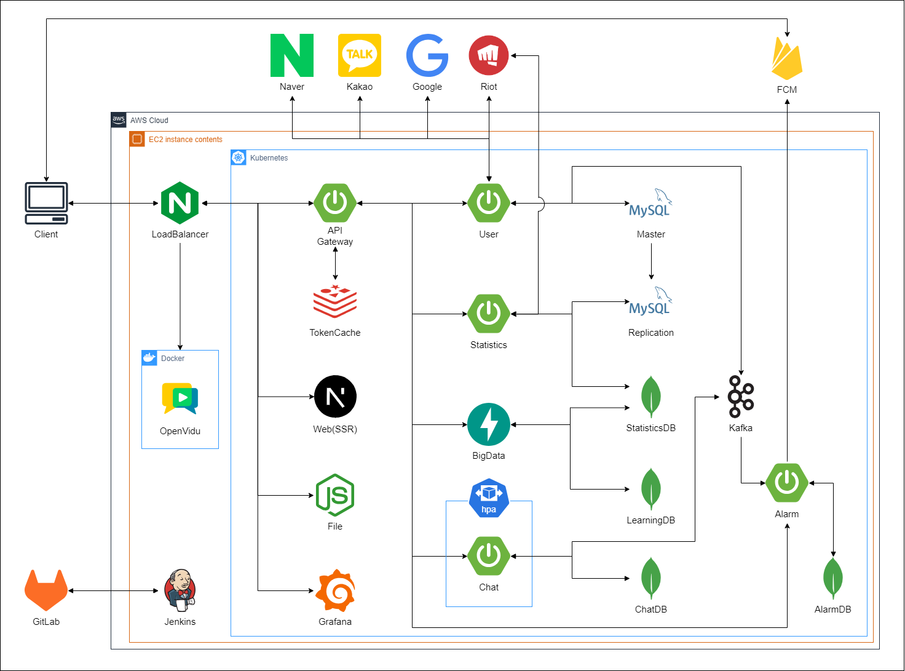

# 매치업(MatchUP)


## 목차

1. [주제](#1-프로젝트-주제)
2. [페르소나](#2-페르소나-분석)
3. [기획서](#3-프로젝트-기획서)
4. [시스템 아키텍쳐](#4-프로젝트-구조)
5. [화면명세서](#5-화면-명세서)
6. [API 명세서](#6-API-명세서)
7. [컨벤션](#7-컨벤션)
8. [일정 관리](#8-일정-관리)

## 1. 프로젝트 주제

### LOL 유저 추천 및 전략 분석, 피드백 커뮤니티

## 2. 페르소나 분석

- 이상혁(27세, 게임을 좋아하는 사람, 롤 챌린저)
- 같이 게임을 할 친구가 마땅치않음
- 인터넷에서 같이 할 사람을 구해봤지만 과정이 불편하고 매칭된 상대가 마음에 들지 않음
- 새로운 사람을 만날 때마다 메신저 정보를 주고받는게 귀찮음
- 플레이에 대한 피드백을 받고 싶음

## 3. 프로젝트 기획서

### 기획의도

게임 유저 추천 및 전략 분석 커뮤니티

### 메인 기능

#### 1. 전적 데이터에 기반해서 승률을 높일 유저 추천

#### 2. 유저의 게임 스타일, 사이트 내에서의 평가를 바탕으로 듀오 추천

#### 3. 유저간 매칭이 되면 그룹 페이지에서 전략 수립 및 보이스/텍스트 채팅

#### 4. 플레이 장면 공유 및 유저 간 소통

### 세부기능

#### 1. 빅데이터 기반 유저 추천

- 함께 플레이하면 승률이 높을 유저를 지표 기반으로 추천
- 플레이 스타일이 맞는 유저를 유사성 기반으로 추천

#### 2. 유저 구인 단체 채팅방(로비)

- 구인 채팅방에서 구인글 작성 및 듀오 모집
- 실시간으로 본인의 게시글 확인 및 다른 유저와 상호작용 가능

#### 3. 유저 간 대화(DM) 및 친구 맺기

- 유저 간 DM을 통해 상호작용
- 친구맺기 기능을 통해 빠르게 친구와 채팅 및 게임을 즐길 수 있음

#### 4. 그룹 형성 및 전적 분석

- 그룹원 간 텍스트 채팅
- 게임 중에도 다른 플랫폼을 이용할 필요 없이 음성채팅 기능 제공

#### 5. 게시판 기능(매치업 존)

- 플레이 장면을 영상이나 사진으로 첨부하여 게시글 작성
- 다른 유저들은 댓글 및 공감으로 의견 공유 가능
- 사람들이 어떤 플레이어의 입장에 더 공감하는지 그래프로 시각화

[맨위로](#매치업MatchUP)

## 4. 프로젝트 구조



[맨위로](#매치업MatchUP)

## 5. 화면 명세서


[맨위로](#매치업MatchUP)

## 6. API 명세서

### 
### 
### 
### 

[맨위로](#매치업MatchUP)

## 7. 컨벤션


### 7-1. 프론트엔드

#### [프론트엔드 코드 컨벤션](https://ui.toast.com/fe-guide/ko_CODING-CONVENTION)

### 7-2. 백엔드

#### 버전관리

- springboot : 3.2.3
- jdk : oracle jdk 17.0.10
- mysql : 8.0.36

#### 1) 변수명

- 상식적인 선에서 변수명 정하기

#### 2) 반복문

- 가급적 for문 사용(람다식 지양)

#### 3) 조건문

- if / else 문 사용(swich - case 지양)
- 예외처리는 if문 위에서 처리 후 로직 수행

#### 4) 유효성 검증

- DTO 유효성 검증 : validated
- Entity 유효성 검증 : DB 제약조건(Constrains)
- Optional은 Repository에서만 사용

#### 5) 공백

- 들여쓰기 4칸
- 이외 IDE(Intellij)가 제공하는 기능 사용

#### 6) 주석

- 컨트롤러 메서드에서만 javadocs 활용 API 명세
- 나머지 메서드에서는 기능 정도만 알아볼 수 있게 작성

#### 7) 테스트

- TDD 적용
- 기능테스트는 미수행

#### 8) API

- API 문서는 swagger 작성
- API 예외처리는 globalExceptionHandler로 수행

#### 9) DTO

- dto 이름 : request/response 나누고 Dto 붙이기
- List만 보내는 dto 별도로 생성
- Message만 보내는 dto 별도 생성

#### 10) 코드리뷰

- MR 단위로 코드리뷰 진행
- 정말 급하거나 중요한 경우를 제외하고는 MR 전에 코드리뷰
- 예외상황은 상호 동의 하에 MR 이후 코드리뷰

### 7-3. 커밋 컨벤션

#### :fire: 커밋 시 가급적 Body를 작성한다.

- feat: 새로운 기능 추가

```
git commit -m "feat : 로그인 기능 추가
# 로그인 기능 구현 완료
- 이제 사용자는 로그인을 할 수 있다.
"
```

- fix: 버그 수정

```
git commit -m "fix : 로그인 오류 수정
# 로그인 오류 수정
- 로그인 로직 중 00오류 확인 후 수정
- 이제 사용자는 정상적으로 로그인을 할 수 있다.
"
```

- docs: 문서 변경

```
git commit -m "docs : README.md 파일 수정"
```

- style: 코드 스타일 변경(공백, 포맷팅 등)

```
git commit -m "style : 코드 스타일 일부 변경
- 코드 가독성을 위해 컨벤션에 맞춰 코드 수정"
```

- refactor: 코드 리팩토링

```
git commit -m "refactor : 컨트롤러 코드 리팩토링
# 컨트롤러 코드 리펙토링하여 코드 가독성 증가"
```

- test: 테스트 코드 작성 또는 수정

```
git commit -m "test : 컨트롤러 테스트코드 추가
# 컨트롤러 기능테스트 추가
- 기능테스트 작성
- 기능테스트 00건 중 00건 통과 / 00건 수정중
"
```

- chore: 기타 작업(빌드 설정, 패키지 업데이트 등)

```
git commit -m "chore : 서버 포트 변경"
```

### 7-4. 브랜치 컨벤션


#### 브랜치 구분

- **master** : 제품의 버전 변경시 작업하기 위한 브랜치
- **hotfix** : 긴급한 오류 발생 시 작업하는 브랜치
- **develop** : 하위 아키텍쳐를 연결하는 브랜치
- **web-server** : 프론트엔드 웹서버
- **user-server** : 유저 비즈니스 로직을 수행하는 WAS(Web Application Server)
- **auth-server** : 인증 및 토큰 발행을 담당하는 WAS
- **chat-server** : 채팅과 관련된 비즈니스 로직을 수행하는 WAS
- **bigdata-server** : 빅데이터 추천 기능을 제공하는 WAS
- **statistics-server** : 통계처리를 하는 서버로 차후 해당 서버에서 처리 및 저장한 데이터를 기반으로 빅데이터 추천 서버가 작동함
- **api-gateway** : 다른 WAS(Web Application Server)로 API 요청을 전송하는 Gateway병합
- **file-server** : 정적 파일(이미지, 동영상 등)을 업로드 및 관리하기 위한 서버
- **alarm-server** : 친구요청, 채팅 등 알람 전송을 위한 서버
- **swagger-server** : API기능을 테스트하기 위한 서버

#### 브랜치 작업 순서

##### 1. master → develop branch 분기

→ 깃 담당자가 직접 분기

##### 2. develop → webserver, appserver, … 등 서버(포트)별 branch 분기

→ 깃 담당자가 직접 분기

##### 3. 서버별 branch → feature(기능)별 branch 분기 : Jira Issue 연동

→ 기능 담당하는 개인이 직접 분기

##### 4. 서버별 branch에서 각자 역할 나눠서 작업 및 MR

→ 기능 담당하는 인원들끼리 MR 수행 및 충돌 해결

##### 5. 작업 후 서버별 branch에서 develop으로 MR

→ 깃 담당자가 확인

##### 6. MR 시 충돌여부 확인 후 병합, CI / CD 확인

→ 깃 담당자 & 인프라 담당자가 확인

### 7-5. MR 컨벤션

MR 시 다음 양식에 맞춰 문서를 작성한다.

```
# MR이 필요한 이유
- MR이 수행되어야 하는 이유, 수행 후 변경사항 등을 작성한다.
ex)
 - 사용자 회원가입 로직 구현
 - 이제 사용자는 회원가입을 할 수 있다.

# 구현
- 다른 MR 참여자가 쉽게 이해할 수 있는 구현 내용을 추가한다.
ex) 웹페이지 화면 캡쳐, 기능 동작 동영상 첨부 등

# 주요 코드
- 해당 MR에서 변경되거나 핵심 로직 등을 코드로 첨부한다.
ex)
    // (생략)
    // 정적 참조 변수
    private static Singleton singletonObject;

    // 객체 생성자(private)
    private Singleton() {
    }

    // 객체 획득 메서드(public)
    public static Singleton getInstance() {
        if (singletonObject == null) {
            singletonObject = new Singleton();
        }

        return singletonObject;
    }
    // (생략)
```

[맨위로](#매치업MatchUP)

## 8. 일정 관리

### 작업순위 및 담당자 선정

#### [1순위] 인증(수민, 성준)

- 회원가입, 로그인
- 라이엇 연동

#### [2순위] 유저(수민, 성준)

- 상세페이지(수민, 상엽)
- 인덱스 페이지료(수민)
- 신고(수민, 성준)
- 소환사 조회(수민)

#### [2순위] 채팅(연우, 준학)

- 로비 채팅(연우, 준학)
- DM(연우, 준학)

#### [3순위] 친구(수민, 성준)

- 친구 관리(수민, 성준)
- 친구 목록(수민, 성준)

#### [2순위] 매치업(연우, 준학)

- 채팅(연우, 준학)
- 보이스채팅(연우, 준학)
- 전략수립(연우, 준학)
- 전적분석(연우, 상엽)
- 화면공유(연우, 준학)
- 피드백(연우, 상엽)

#### [2순위] 매치업 존(수민, 성준)

- 화면공유 내용 게시(수민, 성준)
- 댓글 및 대댓글(수민, 성준)
- 게시글 조회, 검색(수민, 성준)
- 게시글 투표(수민, 성준)
- 공감(수민, 성준)

#### [1순위] 매칭(원석, 상엽)

- 추천 알고리즘(원석, 상엽)
- 유저 추천 페이지(연우)

### 작업일정 선정

#### 2주차(3.4.(월) ~ 3.10.(금))

- 화면정의서, ERD, 시퀀스 다이어그램, API 문서, Jira 작성
- 코드 및 커밋 컨벤션 선정
- 브랜치 분기 및 프로젝트 빌드
- 프로젝트에 필요한 기술스택 학습
- 로그인, 회원가입 로직 설계

#### 3주차(3.11.(월) ~ 3.15.(금))

- 소셜로그인 기능 구현
- 메인페이지 및 검색페이지 생성
- Riot Token 발급 요청
- 쿠버네티스 구축
- 각 서버 / 브랜치별 빌드 및 구축
- 젠킨스 CI / CD 구축
- 소환사 지표 선정
- 빅데이터 알고리즘 선정

#### 4주차(3.18.(월) ~ 3.22.(금))

- DM 채팅기능 구현
- 로비 구인글 기능 구현
- 매치업 존(게시판) 기능 구현
- 유저 상세페이지 구현
- 소환사 지표 생성로직 작성
- 빅데이터 알고리즘 구현
- RSO 발급 요청

#### 5주차(3.25.(월) ~ 3.29.(금))

- 소셜 회원가입 및 로그인 로직 고도화
- 친구추천 기능 구현
- 매치업 기능 구현
- 리그 티어별 1000명 학습용 DB에 저장
- 빅데이터 알고리즘 학습

#### 6주차(4.1.(월) ~ 4.4.(목))

- RSO 발급
- RSO 로그인 기능 구현
- 기능별 디버깅 수행
- css 수정

### 에픽 보고서


### 번다운 차트


[맨위로](#매치업MatchUP)
