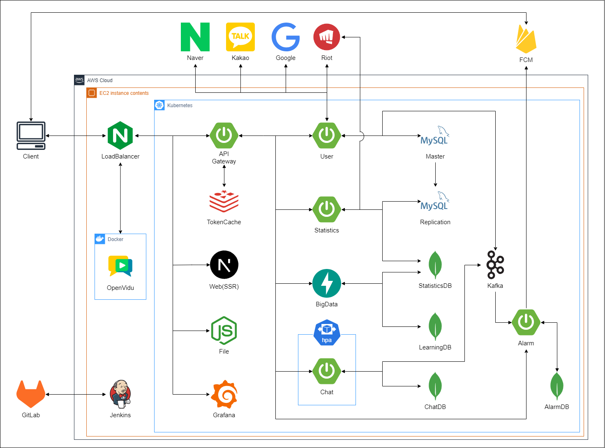

# 매치업(MatchUP)


## 목차

### 1. [주제](#1-프로젝트-주제)

### 2. [페르소나](#2-페르소나-분석)

### 3. [프로젝트 기획](#3-프로젝트-기획)

### 4. [프로젝트 설계](#4-프로젝트-설계)

### 5. [구현 화면](#5-구현-화면)

### 6. [기능 명세서](#6-기능-명세서)

### 7. [API 명세서](#7-API-명세서)

### 8. [일정 관리](#8-일정-관리)

### 9. [프로젝트 관리](#9-프로젝트-관리)

## 1. 프로젝트 주제

### LOL 유저 추천 및 전략 분석, 피드백 커뮤니티

## 2. 페르소나 분석

- 이상혁(27세, 게임을 좋아하는 사람, 롤 챌린저)
- 같이 게임을 할 친구가 마땅치않음
- 인터넷에서 같이 할 사람을 구해봤지만 과정이 불편하고 매칭된 상대가 마음에 들지 않음
- 새로운 사람을 만날 때마다 메신저 정보를 주고받는게 귀찮음
- 플레이에 대한 피드백을 받고 싶음

## 3. 프로젝트 기획서

### 기획의도

#### 게임 유저 추천 및 전략 분석 커뮤니티

### 메인 기능

#### 1. 전적 데이터에 기반해서 승률을 높일 유저 추천

#### 2. 유저의 게임 스타일, 사이트 내에서의 평가를 바탕으로 듀오 추천

#### 3. 유저간 매칭이 되면 그룹 페이지에서 전략 수립 및 보이스/텍스트 채팅

#### 4. 플레이 장면 공유 및 유저 간 소통

### 세부기능

#### 1. 빅데이터 기반 유저 추천

- 함께 플레이하면 승률이 높을 유저를 지표 기반으로 추천
- 플레이 스타일이 맞는 유저를 유사성 기반으로 추천

#### 2. 유저 구인 단체 채팅방(로비)

- 구인 채팅방에서 구인글 작성 및 듀오 모집
- 실시간으로 본인의 게시글 확인 및 다른 유저와 상호작용 가능

#### 3. 유저 간 대화(DM) 및 친구 맺기

- 유저 간 DM을 통해 상호작용
- 친구맺기 기능을 통해 빠르게 친구와 채팅 및 게임을 즐길 수 있음

#### 4. 그룹 형성 및 전적 분석

- 그룹원 간 텍스트 채팅
- 게임 중에도 다른 플랫폼을 이용할 필요 없이 음성채팅 기능 제공

#### 5. 게시판 기능(매치업 존)

- 플레이 장면을 영상이나 사진으로 첨부하여 게시글 작성
- 다른 유저들은 댓글 및 공감으로 의견 공유 가능
- 사람들이 어떤 플레이어의 입장에 더 공감하는지 그래프로 시각화

[맨위로](#매치업matchup)

## 4. 프로젝트 설계

### 시스템 아키텍쳐



### 기술 스택

[맨위로](#매치업matchup)

### 역할 분담

| 성명         | 주 역할 | 기능                                                                                             | 주요 서버 |
| ------------ | ------- | ------------------------------------------------------------------------------------------------ | --------- |
| 이수민(팀장) | FE      | 화면 뷰 생성, 게시판 및 댓글, 친구요청 및 관리, 로그인 및 회원가입, 검색페이지, 상세페이지, 알람 | 웹 서버   |
| 남상엽       | BE      | 데이터베이스 및 파일 관리, 라이엇 API 분석 및 크롤링, 모델 학습데이터 수집                       | 통계 서버 |
| 배성준       | BE      | API Routing, 회원 기본로직 생성, 인증 및 보안, 친구 및 게시판 관리                               | 유저 서버 |
| 이연우       | BE      | 화면 뷰 생성, API 및 RSO 요청, 채팅, 매치업, 빅데이터 추천페이지                                 | 웹 서버   |
| 이원석       | AI      | 분석지표 선정, 추천 알고리즘 및 빅데이터 모델 생성, 추천 API 생성                                | 추천 서버 |
| 이준학       | BE      | 인프라 구축, CI / CD 관리, 가상머신 오케스트레이션, 웹소켓 통신, 채팅 및 알람                    | 채팅 서버 |

## 5. 구현 화면

{: width="100" height="100"}

### 메인페이지

사용자가 처음 접속하면 볼 수 있는 페이지입니다.


### 로비(구인)

로비에서 구인글을 작성할 수 있습니다.


### 추천

빅데이터 기반으로 승률이 높은 유저를 예측하여 추천합니다.


### DM

추천받은 유저나 로비의 유저에게 DM을 보낼 수 있습니다.


### 매치업

매칭된 유저와 매치업 페이지에서 채팅, 음성채팅을 하며 게임을 즐길 수 있습니다.


### 게시판(매치업 존)

게임 내용에 대한 사진이나 영상을 올려 다른 유저의 피드백을 받을 수 있습니다.


### 친구 검색

친구를 맺고 싶은 유저를 찾을 수 있습니다.


### 소환사 조회

특정 유저의 전적을 검색할 수 있습니다.


[맨위로](#매치업matchup)

## 6. 기능 명세서

| 구분        | 주 기능                           | 상세 기능                              | 설명                                                                                                                          | 우선 순위 | 비고                                                           | 페이지 | API |
| ----------- | --------------------------------- | -------------------------------------- | ----------------------------------------------------------------------------------------------------------------------------- | --------- | -------------------------------------------------------------- | ------ | --- |
| 0.인증      | 0.1 회원가입                      | 0.1.1 소셜 회원가입하기                | 유저는 소셜 로그인을 통해 회원가입할 수 있다.                                                                                 | 상        | 카카오톡 API 활용                                              |        |     |
|             | 0.1 회원가입                      | 0.1.2 자체 회원가입하기                | 유저는 아이디, 비밀번호 등을 입력하여 회원가입 할 수 있다.                                                                    | 하        |                                                                |        |     |
|             | 0.2 로그인                        | 0.2.1 카카오톡 로그인하기              | 유저는 카카오톡 로그인을 통해 로그인할 수 있다.                                                                               | 상        | 카카오톡 API 활용                                              |        |     |
|             | 0.2 로그인                        | 0.2.2 자체 로그인하기                  | 유저는 회원가입 시 입력했던 아이디, 비밀번호로 로그인할 수 있다.                                                              | 하        |                                                                |        |     |
|             | 0.3 라이엇 계정 연동              | 0.3.1 라이엇 계정 인증하기             | 유저는 라이엇 RSO 이용해서 라이엇 계정 인증할 수 있다.                                                                        |           |                                                                |        |     |
|             | 0.3 라이엇 계정 연동              | 0.3.2 라이엇 계정 추가하기             | 유저는 추가로 자신의 라이엇 계정을 인증할 수 있다.                                                                            |           |                                                                |        |     |
|             | 0.3 라이엇 계정 연동              | 0.3.3 라이엇 계정 전환하기             | 유저는 현재 사용할 라이엇 계정을 선택하여 전환할 수 있다.                                                                     |           |                                                                |        |     |
|             |                                   |                                        |                                                                                                                               |
| 1. 유저     | 1.1 상세페이지                    | 1.1.1 상세페이지 접속하기              | 유저는 정보(전적 + 평점 + 성향)가 담긴 상세페이지에 접속할 수 있다.                                                           |           |                                                                |        |     |
|             | 1.1 상세페이지                    | 1.1.2 다른 유저 상세페이지 확인하기    | 유저는 다른 사용자의 상세페이지에 접속할 수 있다.                                                                             |           |                                                                |        |     |
|             | 1.1 상세페이지                    | 1.1.3 상세페이지 유저와 DM하기         | 유저는 해당 상세페이지의 유저와 1:1 DM방에 들어갈 수 있다.                                                                    |           |                                                                |        |     |
|             |                                   |                                        |                                                                                                                               |           |                                                                |        |     |
| 2.채팅      | 2.1 로비 채팅                     | 2.1.1 로비 채팅방 접속하기             | 유저는 전체 채팅방에 접속하여 다른 유저들을 확인할 수 있다.                                                                   |           | 최대 채팅 수 100개, 채팅방 참여 유저 리스트                    |        |     |
|             | 2.1 로비 채팅                     | 2.1.2 로비 채팅 보내기                 | 유저는 전체 채팅방에 채팅을 전송할 수 있다.                                                                                   |           |                                                                |        |     |
|             | 2.1 로비 채팅                     | 2.1.3 로비 구인 채팅 보내기            | 유저는 본인을 어필할 수 있는 양식에 맞춰 채팅을 전송할 수 있다.                                                               |           |                                                                |        |     |
|             | 2.2 DM                            | 2.2.1 익명 1:1 DM 접속하기             | 유저는 1:1 채팅방에 접속하여 이전 채팅 내역을 불러와 확인할 수 있다.                                                          |           |                                                                |        |     |
|             | 2.2 DM                            | 2.2.2 익명 1:1 채팅 보내기             | 유저는 1:1 채팅을 전송할 수 있다.                                                                                             |           |                                                                |        |     |
|             | 2.2 DM                            | 2.2.3 친구 1:1 DM 접속하기             | 유저는 친구와 1:1 채팅방에 접속하여 이전 채팅 내역을 불러와 확인할 수 있다.                                                   |           |                                                                |        |     |
|             | 2.2 DM                            | 2.2.4 친구 1:1 채팅 보내기             | 유저는 친구에게 1:1 채팅을 전송할 수 있다.                                                                                    |           |                                                                |        |     |
|             |                                   |                                        |                                                                                                                               |           |                                                                |        |     |
| 3. 친구     | 3.1 친구 관리                     | 3.1.1 친구 요청하기                    | 유저는 다른 유저에게 친구 요청할 수 있다.                                                                                     | 상        |                                                                |        |     |
|             | 3.1 친구 관리                     | 3.1.2 친구 요청받기                    | 유저는 다른 유저의 친구요청을 수락할 수 있다.                                                                                 | 상        |                                                                |        |     |
|             | 3.1 친구 관리                     | 3.1.3 친구에서 제외하기                | 유저는 특정 친구를 제외할 수 있다.                                                                                            | 상        |                                                                |        |     |
|             | 3.2 친구목록                      | 3.2.1 친구목록 상세페이지 확인하기     | 유저는 친구의 상세페이지에 접속할 수 있다.                                                                                    | 상        |                                                                |        |     |
|             | 3.2 친구목록                      | 3.2.2 친구목록에서 DM하기              | 유저는 친구목록에서 특정 친구와 1:1 DM방에 들어갈 수 있다.                                                                    | 상        |                                                                |        |     |
|             |                                   |                                        |                                                                                                                               |           |                                                                |        |     |
| 4. 매치업   | 4.1 채팅                          | 4.1.1 텍스트 채팅하기                  | 유저는 그룹 내에서 텍스트로 채팅할 수 있다.                                                                                   | 상        |                                                                |        |     |
|             | 4.2 보이스 채팅                   | 4.2.1 보이스 채팅하기                  | 유저는 그룹 내에서 보이스로 채팅할 수 있다.                                                                                   | 상        |                                                                |        |     |
|             | 4.2 보이스 채팅                   | 4.2.2 보이스 켜기 / 끄기               | 유저는 보이스를 켤지 끌지 설정할 수 있다.                                                                                     | 상        |                                                                |        |     |
|             | 4.5 화면 공유                     | 4.5.1 본인의 화면 공유하기             | 유저는 본인이 공유하고 싶은 화면을 선택하여 공유할 수 있다.                                                                   | 상        |                                                                |        |     |
|             | 4.6. 평가(피드백)                 | 4.6.1 함께한 그룹원 평가하기           | 유저는 본인과 함께한 그룹원을 평가할 수 있다.                                                                                 | 상        |                                                                |        |     |
|             |                                   |                                        |                                                                                                                               |           |                                                                |        |     |
| 5.매치업 존 | 5.1 화면공유 내용 게시(사진/영상) | 5.1.1 플레이 장면 이미지 파일 게시하기 | 유저는 이미지 파일을 업로드하고 텍스트를 작성할 수 있다.                                                                      |           |                                                                |        |     |
|             | 5.1 화면공유 내용 게시(사진/영상) | 5.1.2 플레이 장면 영상 게시하기        | 유저는 영상 파일을 업로드하고 텍스트를 작성할 수 있다.                                                                        |           |                                                                |        |     |
|             | 5.2 댓글 및 대댓글 작성           | 5.2.1 댓글 작성하기                    | 유저는 특정 게시글에 댓글을 작성할 수 있다.                                                                                   |           |                                                                |        |     |
|             | 5.2 댓글 및 대댓글 작성           | 5.2.2 대댓글 작성하기                  | 유저는 특정 댓글에 대댓글을 작성할 수 있다.                                                                                   |           |                                                                |        |     |
|             | 5.3 게시글 조회                   | 5.3.1 최신순 조회하기                  | 유저는 게시글 페이지 최초 진입 시 게시글을 최신순으로 조회할 수 있다.                                                         |           |                                                                |        |     |
|             | 5.3 게시글 조회                   | 5.3.2 인기게시글(조회수) 조회하기      | 유저는 게시글 페이지 최초 진입 시 게시글을 인기순으로 조회할 수 있다.                                                         |           |                                                                |        |     |
|             | 5.4 게시글 검색                   | 5.4.1 작성자명으로 검색하기            | 유저는 작성자명(ID)으로 특정 유저의 게시물을 검색할 수 있다.                                                                  |           |                                                                |        |     |
|             | 5.4 게시글 검색                   | 5.4.2 게시글제목으로 검색하기          | 유저는 특정 키워드를 포함하는 게시글을 검색할 수 있다.                                                                        |           |                                                                |        |     |
|             | 5.5 게시글 및 댓글 공감           | 5.5.1 게시글 공감하기                  | 유저는 게시글에서 어느 플레이어의 입장에 공감하는지 반응을 남길 수 있다.(ex-찬성vs.반대)                                      |           |                                                                |        |     |
|             | 5.5 게시글 및 댓글 공감           | 5.5.2 댓글 공감하기                    | 유저는 특정 댓글 혹은 대댓글에 좋아요 반응을 남길 수 있다.                                                                    |           |                                                                |        |     |
|             |                                   |                                        |                                                                                                                               |           |                                                                |        |     |
| 6.매칭      | 6.1 추천 알고리즘                 | 6.1.1 승률 기반 추천 알고리즘          | 📝 승률이 높을 것으로 예상되는 유저 추천 📝 최근 전적, 조합별 승률 등을 고려해 승률 예측                                      | 상        | 🗒️ 듀오 기록 EDA 바탕의 승률 예측 모델 - 콘텐츠 기반 필터링    |        |     |
|             | 6.1 추천 알고리즘                 | 6.1.2 평점 기반 추천 알고리즘          | 📝 내가 높은 평점을 줄 것으로 예상되는 유저 (플레이 스타일 기반) 추천 📝 사용 시간대, 마이크, 게임 시간 등을 고려해 평점 예측 | 중        | 🗒️ 나와 비슷한 유저들이 높은 평점을 준 유저 추천 - 협업 필터링 |        |     |
|             | 6.2 유저 추천 토글                | 6.2.1 추천 항목 선택하기               | 📝 어떤 데이터 기반의 추천을 원하는지 선택                                                                                    | 상        |                                                                |        |     |
|             | 6.2 유저 추천 토글                | 6.2.2 추천 유저 목록 확인하기          | 📝 추천 항목 기반으로 선택된 유저 출력                                                                                        | 상        | 🗒️ 추천 상위 5인의 간단한 소개와 채팅 버튼                     |        |     |
|             | 6.2 유저 추천 토글                | 6.2.3 승률 기반 추천목록 확인하기      | 📝 승률이 높을 것으로 예상되는 조합 추천                                                                                      | 하        |                                                                |        |     |
|             | 6.2 유저 추천 토글                | 6.2.3 평점 기반 추천목록 확인하기      | 📝 평점 입력이 적다면 정확도가 낮을 수 있다는 경고 표시                                                                       | 하        |                                                                |        |     |

## 7. API 명세서

### 서버

#### [해당 경로](https://matchup.site/swagger)에서 확인이 가능합니다.


### 로컬

해당 명세서를 다운로드 후, 크롬으로 실행하여 확인합니다.

> 로컬에서는 API요청 전송 및 응답이 불가능합니다.

### [{: width="30" height="30"}User API 명세서](/uploads/48d8baccbcf0d004c0d98de907a07969/index.html)

### [{: width="30" height="30"}Statistics API 명세서](/uploads/6fc2eb379302e05d72ad0cc2d2297547/index.html)

### [{: width="30" height="30"}Chat API 명세서](/uploads/b4b19dfb19d8016988c1db087379c175/index.html)

### [{: width="30" height="30"}Alarm API 명세서](/uploads/6d9b7179336fbc4b2b212d3b30870926/index.html)

[맨위로](#매치업matchup)

## 8. 일정 관리

### 작업순위 및 담당자 선정

#### [1순위] 인증(수민, 성준)

- 회원가입, 로그인
- 라이엇 연동

#### [2순위] 유저(수민, 성준)

- 상세페이지(수민, 상엽)
- 인덱스 페이지료(수민)
- 신고(수민, 성준)
- 소환사 조회(수민)

#### [2순위] 채팅(연우, 준학)

- 로비 채팅(연우, 준학)
- DM(연우, 준학)

#### [3순위] 친구(수민, 성준)

- 친구 관리(수민, 성준)
- 친구 목록(수민, 성준)

#### [2순위] 매치업(연우, 준학)

- 채팅(연우, 준학)
- 보이스채팅(연우, 준학)
- 전략수립(연우, 준학)
- 전적분석(연우, 상엽)
- 화면공유(연우, 준학)
- 피드백(연우, 상엽)

#### [2순위] 매치업 존(수민, 성준)

- 화면공유 내용 게시(수민, 성준)
- 댓글 및 대댓글(수민, 성준)
- 게시글 조회, 검색(수민, 성준)
- 게시글 투표(수민, 성준)
- 공감(수민, 성준)

#### [1순위] 매칭(원석, 상엽)

- 추천 알고리즘(원석, 상엽)
- 유저 추천 페이지(연우)

### 작업일정 선정

#### 2주차(3.4.(월) ~ 3.10.(금))

- 화면정의서, ERD, 시퀀스 다이어그램, API 문서, Jira 작성
- 코드 및 커밋 컨벤션 선정
- 브랜치 분기 및 프로젝트 빌드
- 프로젝트에 필요한 기술스택 학습
- 로그인, 회원가입 로직 설계

#### 3주차(3.11.(월) ~ 3.15.(금))

- 소셜로그인 기능 구현
- 메인페이지 및 검색페이지 생성
- Riot Token 발급 요청
- 쿠버네티스 구축
- 각 서버 / 브랜치별 빌드 및 구축
- 젠킨스 CI / CD 구축
- 소환사 지표 선정
- 빅데이터 알고리즘 선정

#### 4주차(3.18.(월) ~ 3.22.(금))

- DM 채팅기능 구현
- 로비 구인글 기능 구현
- 매치업 존(게시판) 기능 구현
- 유저 상세페이지 구현
- 소환사 지표 생성로직 작성
- 빅데이터 알고리즘 구현
- RSO 발급 요청

#### 5주차(3.25.(월) ~ 3.29.(금))

- 소셜 회원가입 및 로그인 로직 고도화
- 친구추천 기능 구현
- 매치업 기능 구현
- 리그 티어별 1000명 학습용 DB에 저장
- 빅데이터 알고리즘 학습

#### 6주차(4.1.(월) ~ 4.4.(목))

- RSO 발급
- RSO 로그인 기능 구현
- 기능별 디버깅 수행
- css 수정

## 9. 프로젝트 관리

### 컨벤션

#### 코드 컨벤션

##### 프론트엔드

###### [프론트엔드 코드 컨벤션](https://ui.toast.com/fe-guide/ko_CODING-CONVENTION)

##### 백엔드

###### 버전관리

- springboot : 3.2.3
- jdk : oracle jdk 17.0.10
- mysql : 8.0.36

###### 1) 변수명

- 상식적인 선에서 변수명 정하기

###### 2) 반복문

- 가급적 for문 사용(람다식 지양)

###### 3) 조건문

- if / else 문 사용(swich - case 지양)
- 예외처리는 if문 위에서 처리 후 로직 수행

###### 4) 유효성 검증

- DTO 유효성 검증 : validated
- Entity 유효성 검증 : DB 제약조건(Constrains)
- Optional은 Repository에서만 사용

###### 5) 공백

- 들여쓰기 4칸
- 이외 IDE(Intellij)가 제공하는 기능 사용

###### 6) 주석

- 컨트롤러 메서드에서만 javadocs 활용 API 명세
- 나머지 메서드에서는 기능 정도만 알아볼 수 있게 작성

###### 7) 테스트

- TDD 적용
- 기능테스트는 미수행

###### 8) API

- API 문서는 swagger 작성
- API 예외처리는 globalExceptionHandler로 수행

###### 9) DTO

- dto 이름 : request/response 나누고 Dto 붙이기
- List만 보내는 dto 별도로 생성
- Message만 보내는 dto 별도 생성

###### 10) 코드리뷰

- MR 단위로 코드리뷰 진행
- 정말 급하거나 중요한 경우를 제외하고는 MR 전에 코드리뷰
- 예외상황은 상호 동의 하에 MR 이후 코드리뷰

#### 커밋 컨벤션

##### :fire: 커밋 시 가급적 Body를 작성한다.

- feat: 새로운 기능 추가

```
git commit -m "feat : 로그인 기능 추가
# 로그인 기능 구현 완료
- 이제 사용자는 로그인을 할 수 있다.
"
```

- fix: 버그 수정

```
git commit -m "fix : 로그인 오류 수정
# 로그인 오류 수정
- 로그인 로직 중 00오류 확인 후 수정
- 이제 사용자는 정상적으로 로그인을 할 수 있다.
"
```

- docs: 문서 변경

```
git commit -m "docs : README.md 파일 수정"
```

- style: 코드 스타일 변경(공백, 포맷팅 등)

```
git commit -m "style : 코드 스타일 일부 변경
- 코드 가독성을 위해 컨벤션에 맞춰 코드 수정"
```

- refactor: 코드 리팩토링

```
git commit -m "refactor : 컨트롤러 코드 리팩토링
# 컨트롤러 코드 리펙토링하여 코드 가독성 증가"
```

- test: 테스트 코드 작성 또는 수정

```
git commit -m "test : 컨트롤러 테스트코드 추가
# 컨트롤러 기능테스트 추가
- 기능테스트 작성
- 기능테스트 00건 중 00건 통과 / 00건 수정중
"
```

- chore: 기타 작업(빌드 설정, 패키지 업데이트 등)

```
git commit -m "chore : 서버 포트 변경"
```

#### 브랜치 컨벤션


##### 브랜치 구분

- **master** : 제품의 버전 변경시 작업하기 위한 브랜치
- **hotfix** : 긴급한 오류 발생 시 작업하는 브랜치
- **develop** : 하위 아키텍쳐를 연결하는 브랜치
- **web-server** : 프론트엔드 웹서버
- **user-server** : 유저 비즈니스 로직을 수행하는 WAS(Web Application Server)
- **auth-server** : 인증 및 토큰 발행을 담당하는 WAS
- **chat-server** : 채팅과 관련된 비즈니스 로직을 수행하는 WAS
- **bigdata-server** : 빅데이터 추천 기능을 제공하는 WAS
- **statistics-server** : 통계처리를 하는 서버로 차후 해당 서버에서 처리 및 저장한 데이터를 기반으로 빅데이터 추천 서버가 작동함
- **api-gateway** : 다른 WAS(Web Application Server)로 API 요청을 전송하는 Gateway병합
- **file-server** : 정적 파일(이미지, 동영상 등)을 업로드 및 관리하기 위한 서버
- **alarm-server** : 친구요청, 채팅 등 알람 전송을 위한 서버
- **swagger-server** : API기능을 테스트하기 위한 서버

##### 브랜치 작업 순서

###### 1. master → develop branch 분기

→ 깃 담당자가 직접 분기

###### 2. develop → webserver, appserver, … 등 서버(포트)별 branch 분기

→ 깃 담당자가 직접 분기

###### 3. 서버별 branch → feature(기능)별 branch 분기 : Jira Issue 연동

→ 기능 담당하는 개인이 직접 분기

###### 4. 서버별 branch에서 각자 역할 나눠서 작업 및 MR

→ 기능 담당하는 인원들끼리 MR 수행 및 충돌 해결

###### 5. 작업 후 서버별 branch에서 develop으로 MR

→ 깃 담당자가 확인

###### 6. MR 시 충돌여부 확인 후 병합, CI / CD 확인

→ 깃 담당자 & 인프라 담당자가 확인

#### MR 컨벤션

MR 시 다음 양식에 맞춰 문서를 작성한다.

```
# MR이 필요한 이유
- MR이 수행되어야 하는 이유, 수행 후 변경사항 등을 작성한다.
ex)
 - 사용자 회원가입 로직 구현
 - 이제 사용자는 회원가입을 할 수 있다.

# 구현
- 다른 MR 참여자가 쉽게 이해할 수 있는 구현 내용을 추가한다.
ex) 웹페이지 화면 캡쳐, 기능 동작 동영상 첨부 등

# 주요 코드
- 해당 MR에서 변경되거나 핵심 로직 등을 코드로 첨부한다.
ex)
    // (생략)
    // 정적 참조 변수
    private static Singleton singletonObject;

    // 객체 생성자(private)
    private Singleton() {
    }

    // 객체 획득 메서드(public)
    public static Singleton getInstance() {
        if (singletonObject == null) {
            singletonObject = new Singleton();
        }

        return singletonObject;
    }
    // (생략)
```

[맨위로](#매치업matchup)

### 지라 보고서

#### 에픽 보고서


#### 번다운 차트


[맨위로](#매치업matchup)
