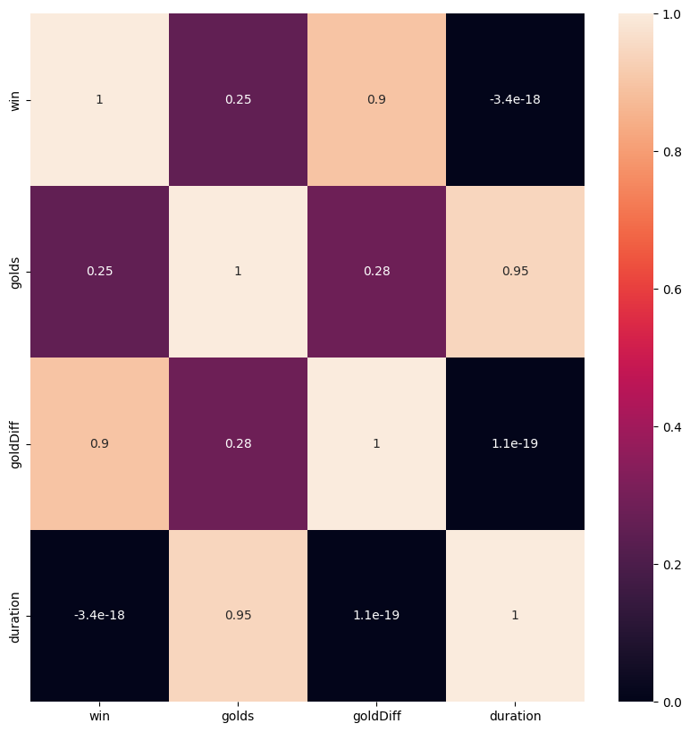
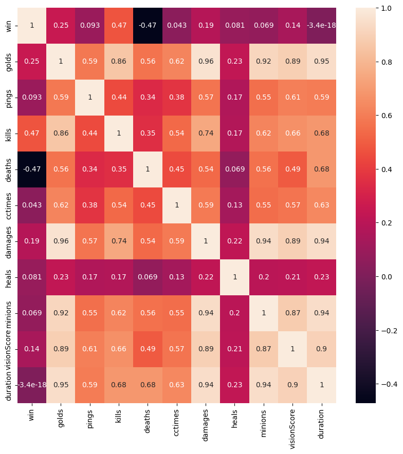

# Bigdata Server Branch

리그오브레전드 개인/2인 랭크 게임을 함께 플레이할 유저를 추천하는 알고리즘 서버

## 목차

1. [시장 분석](#1-시장-분석)
2. [데이터 분석](#2-리그오브레전드-데이터-분석)
3. [추천 시스템](#3-추천-시스템)
4. [참조](#0-참조)

## 1. 시장 분석

### 기존 유사 사이트

- 듀오 찾기 사이트
  - [DUO.LoL]("https://duo.op.gg/ko/lol/")
- 듀오 찾기 커뮤니티
  - [YOUR.GG]("https://your.gg/ko/kr/duo-request")
  - [OP.GG]("https://talk.op.gg/s/lfg/all?sort=recent")
  - [LoLKor 네이버 카페]("https://cafe.naver.com/lolkor")
- 메신저 프로그램
  - Discord
  - Lita

### 유저 니즈 파악

유일한 듀오를 위한 사이트이자 가장 활발히 사용되고 있는 DUO.LoL 사이트를 통해 유저 니즈 파악 (실패한다면 기존의 YOUR.GG의 데이터 사용)

#### 구인글 데이터 수집

- selenium 을 활용한 데이터 크롤링
  - 동적으로 듀오 구인글을 표시하고 있기 때문에 selenium을 활용
- 크롤링한 데이터 csv 파일로 저장

#### 구인글 데이터 전처리

- 수집된 데이터 확인
  - Word2Vec 활용 #####################################################

- 데이터 특징
  - 아무런 구인글이 없는 데이터 존재 → 해당 행 삭제
  - 광고글 존재 → 데이터를 흐릴 가능성이 있기 때문에 삭제(현재까지는 강의 라는 이름이 들어가는 구인글 삭제) → 추후 따로 학습하여 광고 제거 또한 가능할 것으로 판단 → 광고 / 욕설이라고 여겨지는 데이터 따로 저장하여 사용 계획
  - 이모티콘 다수 사용 (ex) ㅠㅠ, ㄱㄱㄱ, @@ 등
  - 괄호의 사용으로 인한 혼동
  - 문법에 맞지 않는 표현 다수 사용

- 데이터 분류
  - 승률을 높이기 위해서
    - 호흡 맞추기
    - 조합 맞추기
    - 부캐 듀오
    - 다른 라인에 믿음
  - 즐겁게 같이 할 사람을 찾기 위해서
    - 이야기 나누기
    - 비슷한 연령대
    - 인성 좋은 유저
    - 게임에 진심인 유저
    - 즐길 유저
    - 재미있는 유저
    - 포기하지 않는 유저
  - 기타
    - 토큰작
    - 아무나
    - 여성, 남성

### 방향성 설정

1. 높은 승률이 예상되는 유저 추천
2. 나와 비슷한 성향의 유저 추천

[맨 위로](#bigdata-server-branch)

## 2. 리그오브레전드 데이터 분석

### APIs - Riot Developer Portal

- 공식 문서 및 API 분석
- [LeagueOfLegendsApi](docs/APIs.md)

### 리그오브레전드 유저 데이터 수집

#### LEAGUE-V4

- 티어별 유저 데이터
- `https://kr.api.riotgames.com/lol/league/v4/entries/RANKED_SOLO_5x5/tier/division?page=1`
- 데이터
  - LeagueEntryDto
  - MiniSeriesDto

#### 리그오브레전드 유저 데이터 수집 한계점

- Riot API 를 통해 데이터를 수집하기 때문에 시간적 제약이 존재
  - 요청 한 번당 500ms 정도의 시간이 소요
  - 한 소환사의 최근 20게임의 정보를 불러오는데 10s ~ 11s 소요
  - 모든 유저를 불러오는 것은 시간적 한계가 존재

### 리그오브레전드 유저 데이터 분석

#### 티어 별 유저 수

- 2024년 03월 15일 금요일까지 획득한 데이터 기준
- 챌린저 - 300
- 그랜드마스터 - 700
- 마스터 - 16297
- 다이아몬드
  - I   - 11,523
  - II  - 16,018
  - III - 24,125
  - IV  - 55,387
- 에메랄드
  - I   - 53,208
  - II  - 55,622
  - III - 81,612
  - IV  - 170,120
- 플래티넘
  - I   - 87,727
  - II  - 120,834
  - III - 143,653
  - IV  - 215,763
- 골드
  - I   - 110,552
  - II  - 128,552
  - III - 126,508
  - IV  - 164,222
- 실버
  - I   - 92,107
  - II  - 108,770
  - III - 117,149
  - IV  - 144,695
- 브론즈
  - I   - 97,952
  - II  - 115,606
  - III - 118,803
  - IV  - 132,090
- 아이언
  - I   - 79,076
  - II  - 65,616
  - III - 38,660
  - IV  - 25,535

#### 듀오 티어 제한

- 듀오 불가능
  - 챌린저
  - 그랜드마스터
  - 마스터
- 다이아몬드
  - 2단계 이내의 티어
- 에메랄드
  - 2단계 이내의 다이아몬드
  - 에메랄드
  - 플레티넘
- 플레티넘
  - 에메랄드
  - 플레티넘
  - 골드
- 골드
  - 플레티넘
  - 골드
  - 실버
- 실버
  - 골드
  - 실버
  - 브론즈
  - 아이언
- 브론즈
  - 골드
  - 실버
  - 아이언
- 아이언
  - 실버
  - 브론즈
  - 아이언

#### 유저 수 분석

- 듀오가 가능한 티어대의 최대 유저 - 215,763
- 듀오가 가능한 티어대의 최소 유저 -  11,523

#### 표본 설정

- 전체 유저를 통한 데이터 분석을 진행하는 것이 아닌 표본을 통해 모집단의 파악이 필요
- 전체 데이터를 확인하는 과정은 어려움이 있기 때문에 대표성을 높이거나 적절한 추출 방식을 확인하기 어려움
- 표본의 크기를 최대한 증가 시켜 포본 오차를 감소시키는 방식 고려
- 표본 크기에 따른 표본 오차의 변화 확인
  - 적정 표본 크기는 500개 이상으로 추정
  - 모델 학습시 과적합을 방지하기 위해 대략 1000개의 표본 설정
- 표본 결정에 대한 논문 참고 [[1](#1)]

### 리그오브레전드 게임 데이터 수집

- 게임 데이터의 경우 두 가지 데이터 제공
  - 게임 통합 데이터
  - 게임 타임라인 데이터

- 리그오브레전드 프로 게임 지표 참고

#### MATCH-V5

1. 게임 통합 데이터
   - `https://asia.api.riotgames.com/lol/match/v5/matches/matchid`
   - 게임 전반에 걸친 데이터 저장
   - 게임당 1MB 이하
   - 데이터
     - MetadataDto
     - InfoDto
     - ParticipantDto
     - PerksDto
     - TeamDto
     - ObjectiveDto

2. 게임 타임라인 데이터
   - `https://asia.api.riotgames.com/lol/match/v5/matches/matchid/timeline`
   - 게임 데이터를 분 단위로 상세 저장
   - 게임당 2MB 이상
   - 데이터
     - MetadtaDto
     - FrameDto
     - ParticipantDto

#### 리그오브레전드 게임 데이터 수집 한계점

- Riot API 를 통해 불러온 데이터의 정보가 많기 때문에 공간적 제약이 존재
  - timeline 데이터의 경우 json 으로 저장시 게임당 2MB
  - 데이터 전처리를 통한 파일 압축 필요

### 리그오브레전드 게임 데이터 전처리

#### 리그오브레전드 게임 통합 데이터 전처리

- 중복 데이터 처리
  - 동일한 정보에 대해 여러 방식으로 정보 제공
    - ParticipantDto 에 저장된 항목이 모여 TeamDto 에 저장 → 개별 값이 중요하기에 TeamDto 정보 제외
    - challenges 항목 중 통합 데이터 바탕으로 계산된 결과 저장 → challenges 내의 계산된 결과 값 사용
    - 라인 정보 individualPosition, lane, teamPosition 으로 저장 → 가장 결측치가 적은 teamPosition 사용
  - 서로 다른 유저의 중복 게임 정보 존재 가능 → 제외

- 결측치 처리
  - 비어 있는 값이 많은 항목 혹은 무의미한 정보가 저장된 항목 존재
    - challenges 항목의 대다수는 결측치로 추정 → 제외
    - missions 항목 값 0 할당 → 제외
    - 타 유저 정보 항목 값 0 할당 → 제외

- 불필요 데이터 처리
  - MetadataDto 불필요
  - 룬 관련 정보 불필요
  - 아이템 관련 정보 불필요
  - 15분 이전 종료 게임 정보
    - 15분부터 조기 항복이 가능
    - 비정상 종료 게임 존재
    - 20분 이전의 기록은 유의미한 비율을 차지하기 때문에 분석 대상으로 추가

- 깊게 중첩된 데이터 형태
  - 데이터 분석 과정의 불편함 → 한 단계의 데이터 형태로 변환

- 개별 유저 데이터로 분리
  - 팀 전체 골드 중 2인 유저의 영향력을 확인해보면 모든 라인이 아래와 같이 상관관계가 크지 않은 것을 확인
  - 2인 유저를 통해 팀 전체 골드를 예측한 회귀선 또한 경향성을 확인하기 어려움
  - 따라서 팀 통합 데이터보다는 2인 유저에 대한 데이터가 필요하기에 개별 유저 데이터로 분리하여 분석

### 리그오브레전드 게임 데이터 분석

#### 리그오브레전드 게임 데이터 분석 목표

- 게임의 승률에 영향을 주는 요인 파악
- 유저의 게임 실력 및 스타일을 지표로 표현

#### 리그오브레전드 프로 게임 지표

- KDA
- DPM
- DPM-D
- DMG/GOLD
- DMG%
- KP
- CS@10
- CS@15
- GD@10
- GD@15
- XP@15
- KILL+ASSIST@15
- SOLO KILLS
- PICKS
- COUNTER JUNGLE%
- DUO KILLS
- DUO PROXIMITY
- VISION SCORE

#### 리그오브레전드 게임 데이터 분석 가설

1. 조합에 따른 플레이 방식이 존재하고 조합별로 유불리가 나뉜다.
   - 프로 게임 지표에 챔피언 사용 통계가 존재
   - 유저 경험에 의하면 챔피언별로 상대 방식에 차이가 존재
2. 게임을 승리하기 위해서는 골드를 많이 벌어야 한다.
   - 프로 게임 지표에 골드와 관련된 지표 다수 존재
3. 승리를 위해서는 라인전을 잘 해야 한다.
   - 프로 게임 지표에 라인전 지표가 존재
4. 지표는 절대적인 지표보다는 상대적인 지표가 신뢰성이 높다.
   - 프로 게임 지표에 절대적 지표보다는 상대적 지표를 많이 사용

#### 리그오브레전드 게임 데이터 조합 분석

- 팀 조합별 데이터 확인
  - 팀 조합이 일치하는 경우 존재 X

- 라인 조합별 데이터 확인
  - 탑   -  822개의 조합 /  554개의 단일 조합
  - 정글 -  609개의 조합 /  354개의 단일 조합
  - 미드 -  708개의 조합 /  441개의 단일 조합
  - 바텀 - 1312개의 조합 / 1298개의 단일 조합
  - 존재하는 조합 중 50% 이하만이 유의미한 승률 차이가 존재
  - 조합이 너무 다양해 판단이 불가능
  - 또한 조합이 강제가 아니기에 조합 선택 또한 유저의 특징

#### 리그오브레전드 게임 데이터 승률 분석

- 골드와 승리의 상관관계 분석
  - 골드 자체는 승리와 낮은 상관관계
  - 골드는 게임을 오래할수록 많이 획득하고 상대와 겨루는 게임이기 때문에 상대적인 값이 중요
  - 골드 차이와 승리는 굉장히 높은 상관관계
  - 골드 차이를 많이 발생시킬 수 있는지가 중요

- 골드를 이기고도 진 개임
  - 전체 게임의 2% 이하만이 골드를 이기고도 게임에 패배
  - 그 중 절반이상이 500골드 이하의 적은 골드 차이거나 골드를 벌고 사용하지 못한 경우
  - 그 외의 게임도 마지막 극적인 역전 데이터로 추정
  - 따라서 실력 지표로 가장 유의미한 지표는 골드 차이

- 라인전과 승리의 상관관계 분석
  - 위의 결과를 바탕으로 골드 리드 여부를 통해 라인전의 승리 여부 판단
  - 라인전의 기준 선정
    - 프로 게임 지표를 보면 10분, 15분 등 다양한 정보가 존재
    - 게임별로 라인전을 분리하기에는 데이터의 한계로 판단의 근거가 부족
    - 15분을 기점으로 골드의 리드 여부가 승리와 높은 연관성을 보이기에 15분으로 선정
  - 15분 골드 리드와 승리의 상관관계
    - 10분 골드 리드 팀의 55% 이하만이 최종 승리 달성
    - 15분 골드 리드 팀의 75% 이상이 최종 승리 달성
    - 20분 골드 리드 팀의 70% 이상이 최종 승리 달성
    - 심리적인 부분에서도 영향이 있고 유리한 팀이 더 많은 골드를 획득하기 쉬운 구조
    - 게임 제작사에서도 해당 부분을 인지하여 불리한 팀이 득점했을 경우 더 많은 골드를 획득하는 장치인 현상금 제도를 도입
    - 하지만 지표를 확인한 결과 지고 있는 팀의 현상금을 통한 역전은 매우 낮은 확률

- 여러 지표들과 승리의 상관관계 분석
  - API 를 통해 제공되는 데이터 자체에서는 승리와 상관관계가 높은 데이터를 찾기 어려움
  - 대신 지표들끼리 상관관계가 높은 항목들이 다수 존재
  - 다중 공선성 문제가 유발될 수 있기에 상대 지표로 변환하여 사용
  - 어느 정도 연관이 있는 지표는 승률 추천에 활용 그 이외의 지표는 성향 추천에 활용

### 리그오브레전드 게임 데이터 분석 결과

- 데이터에 따르면 게임의 승리를 위해서는 라인전을 잘 하고 그 우위를 바탕으로 골드를 많이 벌어들이는 방향성이 가장 좋은 방식으로 여겨짐
- 따라서 가장 중요한 골드를 많이 벌어들일 수 있는 능력을 우선시하여 유저 특성 저장
- 하지만 단순히 1대 1로 겨루는 방식은 아니기에 변수 발생의 여지가 높음
- 해당 부분에서 억울함을 토로하는 유저들을 대다수 확인하였기 때문에 골드를 벌어들이지 않고 골드를 벌어들인 효과를 볼 수 있는 특성 및 팀에서의 영향력 또한 저장

- 게임 플레이 패턴에서 얻을 수 있는 유저 특성
  - 라인전
    - CS 차이 - 서포터의 경우 유사한 서포터 아이템 완성 시간으로 변환
    - 포탑 채굴 횟수 차이
    - 챔피언에게 가한 피해량 차이
    - 경험치 차이
    - 챔피언에게 가한 피해량 차이
  - 라인전 이후
    - 타워 철거
      - 타워 철거 점수
      - 팀내 타워 데미지 비중
    - 이니시
      - CC 점수
      - 팀내 받은 데미지 비중
    - 시야
      - 시야 점수
      - 상대 정글 캠프 획득 점수
    - 오브젝트
      - 오브젝트 점수
    - 데미지
      - 골드당 데미지
      - 팀내 데미지 비중

- 게임과 밀접한 연관이 깊지 않은 요소들을 통해 얻을 수 있는 유저 특성
  - 평균 게임 시간
  - 핑 횟수
  - 이른 서렌 횟수
  - 기본 실력 점수

- matchup 서비스를 통해 얻을 수 있는 유저 특성 정보
  - 게임 시간대
  - 유저 평점
  - 간접적인 상호작용이 있는 유저
  - 패배했음에도 불구하고 게임을 진행한 유저

- 최근 20게임으로 라인별로 분리하여 유저 특성 저장
  - 많은 유저들이 함께 하고 싶은 라인 선택 선호
  - 메타와 패치에 따라 최근 게임 플레이가 중요

[맨 위로](#bigdata-server-branch)

## 3. 추천 시스템

### 승률

#### 유저 데이터 수집

- Riot API 를 활용한 데이터 수집이 가능할 경우

### 즐거움

### 구인글

[맨 위로](#bigdata-server-branch)

## 0. 참조

### 1

Park Wonu. Son Seungyeon. Park Haesin. Park Hyesang, "적정 표본크기 결정을 위한 제언", "Seoul Journal of Industrial Relations vol.21", 7, 2010.

[맨 위로](#bigdata-server-branch)
